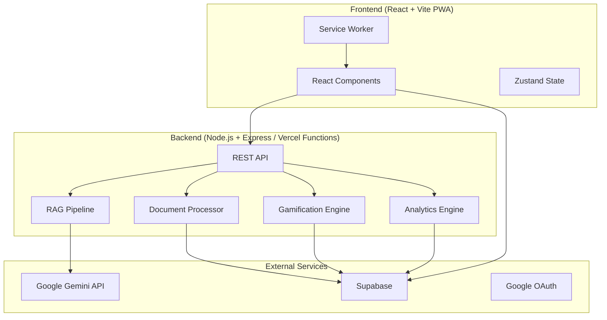
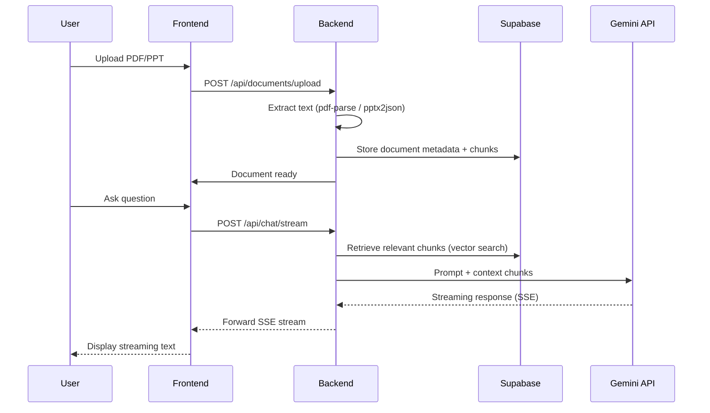

# Design Document: LECTOR Platform

## Overview

LECTOR adalah platform belajar berbasis AI untuk mahasiswa Indonesia, dibangun sebagai Progressive Web App (PWA). Platform ini memungkinkan mahasiswa mengunggah materi kuliah (PDF/PPT), berinteraksi dengan AI untuk mendapatkan penjelasan streaming, membuat ringkasan otomatis, mengerjakan soal adaptif, dan memantau progres belajar melalui sistem gamifikasi.

### Tech Stack

- **Frontend**: React.js + Vite, TypeScript, Tailwind CSS, PWA
- **Backend**: Node.js + Express, TypeScript
- **Database & Auth**: Supabase (PostgreSQL + Auth + Storage)
- **AI**: Google Gemini API (gemini-1.5-flash / gemini-1.5-pro)
- **Deployment**: Vercel (frontend + backend as serverless functions)
- **Document Processing**: pdf-parse (PDF), pptx2json / officegen (PPT/PPTX)
- **Property-Based Testing**: fast-check (TypeScript/JavaScript)

---

## Architecture

LECTOR menggunakan arsitektur client-server dengan RAG (Retrieval-Augmented Generation) pipeline untuk AI responses.



### RAG Pipeline Architecture



---

## Components and Interfaces

### Frontend Components

```
src/
├── pages/
│   ├── LandingPage.tsx
│   ├── AuthPage.tsx
│   ├── DashboardPage.tsx
│   ├── ChatPage.tsx
│   ├── QuizPage.tsx
│   ├── ExamPage.tsx
│   ├── AnalyticsPage.tsx
│   └── HistoryPage.tsx
├── components/
│   ├── layout/
│   │   ├── Sidebar.tsx
│   │   └── Navbar.tsx
│   ├── chat/
│   │   ├── ChatInterface.tsx
│   │   ├── MessageBubble.tsx
│   │   └── QuickActions.tsx
│   ├── quiz/
│   │   ├── QuizCard.tsx
│   │   ├── QuizResult.tsx
│   │   └── QuestionNav.tsx
│   ├── exam/
│   │   ├── ExamSetup.tsx
│   │   ├── ExamSession.tsx
│   │   └── ExamResult.tsx
│   ├── gamification/
│   │   ├── XPBar.tsx
│   │   ├── BadgeGrid.tsx
│   │   └── StreakDisplay.tsx
│   ├── analytics/
│   │   ├── ActivityChart.tsx
│   │   └── TopicPerformance.tsx
│   └── document/
│       ├── DocumentUpload.tsx
│       └── DocumentList.tsx
├── hooks/
│   ├── useAuth.ts
│   ├── useChat.ts
│   ├── useQuiz.ts
│   └── useGamification.ts
├── services/
│   ├── api.ts
│   ├── supabase.ts
│   └── streaming.ts
└── store/
    ├── authStore.ts
    ├── documentStore.ts
    └── gamificationStore.ts
```

### Backend API Endpoints

```
POST   /api/auth/register
POST   /api/auth/login
POST   /api/auth/google

POST   /api/documents/upload
GET    /api/documents
DELETE /api/documents/:id

POST   /api/chat/stream          (SSE)
POST   /api/chat/summary

POST   /api/quiz/generate
POST   /api/quiz/submit
GET    /api/quiz/history

POST   /api/exam/start
POST   /api/exam/submit
GET    /api/exam/history

GET    /api/analytics
GET    /api/history
GET    /api/gamification/profile
POST   /api/gamification/award-xp
```

### Key Interfaces (TypeScript)

```typescript
interface User {
  id: string;
  email: string;
  fullName: string;
  avatarUrl?: string;
  createdAt: Date;
}

interface GamificationProfile {
  userId: string;
  xp: number;
  level: number;
  streak: number;
  lastActiveDate: string; // ISO date
  badges: Badge[];
}

interface Document {
  id: string;
  userId: string;
  fileName: string;
  fileType: 'pdf' | 'ppt' | 'pptx';
  fileSize: number;
  pageCount: number;
  uploadedAt: Date;
  status: 'processing' | 'ready' | 'error';
  storagePath: string;
}

interface DocumentChunk {
  id: string;
  documentId: string;
  content: string;
  chunkIndex: number;
  embedding?: number[]; // for vector search
}

interface ChatMessage {
  id: string;
  sessionId: string;
  role: 'user' | 'assistant';
  content: string;
  createdAt: Date;
}

interface QuizQuestion {
  id: string;
  documentId: string;
  question: string;
  options: { A: string; B: string; C: string; D: string };
  correctAnswer: 'A' | 'B' | 'C' | 'D';
  explanation: string;
}

interface QuizSession {
  id: string;
  userId: string;
  documentId: string;
  questions: QuizQuestion[];
  answers: Record<string, 'A' | 'B' | 'C' | 'D'>;
  score: number;
  xpEarned: number;
  completedAt?: Date;
}

interface ExamSession extends QuizSession {
  totalTimeSeconds: number;
  timeRemainingSeconds: number;
  isCompleted: boolean;
}

interface Badge {
  id: string;
  name: string;
  description: string;
  iconUrl: string;
  earnedAt?: Date;
}

interface ActivityRecord {
  id: string;
  userId: string;
  type: 'chat' | 'quiz' | 'exam' | 'summary';
  documentId?: string;
  documentName?: string;
  score?: number;
  xpEarned: number;
  createdAt: Date;
}

interface AnalyticsSummary {
  totalXP: number;
  currentStreak: number;
  quizzesCompleted: number;
  averageScore: number;
  activityByDay: { date: string; count: number }[];
  topicPerformance: { documentName: string; averageScore: number }[];
}
```

---

## Data Models

### Supabase Database Schema

```sql
-- Users (managed by Supabase Auth, extended via profiles)
CREATE TABLE profiles (
  id UUID PRIMARY KEY REFERENCES auth.users(id) ON DELETE CASCADE,
  full_name TEXT NOT NULL,
  avatar_url TEXT,
  created_at TIMESTAMPTZ DEFAULT NOW()
);

-- Gamification
CREATE TABLE gamification_profiles (
  id UUID PRIMARY KEY DEFAULT gen_random_uuid(),
  user_id UUID UNIQUE NOT NULL REFERENCES profiles(id) ON DELETE CASCADE,
  xp INTEGER DEFAULT 0,
  level INTEGER DEFAULT 1,
  streak INTEGER DEFAULT 0,
  last_active_date DATE,
  updated_at TIMESTAMPTZ DEFAULT NOW()
);

-- Badges
CREATE TABLE badges (
  id UUID PRIMARY KEY DEFAULT gen_random_uuid(),
  name TEXT NOT NULL,
  description TEXT NOT NULL,
  icon_url TEXT,
  trigger_type TEXT NOT NULL, -- 'streak', 'quiz_count', 'perfect_score', etc.
  trigger_value INTEGER NOT NULL
);

CREATE TABLE user_badges (
  id UUID PRIMARY KEY DEFAULT gen_random_uuid(),
  user_id UUID NOT NULL REFERENCES profiles(id) ON DELETE CASCADE,
  badge_id UUID NOT NULL REFERENCES badges(id),
  earned_at TIMESTAMPTZ DEFAULT NOW(),
  UNIQUE(user_id, badge_id)
);

-- Documents
CREATE TABLE documents (
  id UUID PRIMARY KEY DEFAULT gen_random_uuid(),
  user_id UUID NOT NULL REFERENCES profiles(id) ON DELETE CASCADE,
  file_name TEXT NOT NULL,
  file_type TEXT NOT NULL CHECK (file_type IN ('pdf', 'ppt', 'pptx')),
  file_size INTEGER NOT NULL,
  page_count INTEGER,
  storage_path TEXT NOT NULL,
  status TEXT DEFAULT 'processing' CHECK (status IN ('processing', 'ready', 'error')),
  uploaded_at TIMESTAMPTZ DEFAULT NOW()
);

CREATE TABLE document_chunks (
  id UUID PRIMARY KEY DEFAULT gen_random_uuid(),
  document_id UUID NOT NULL REFERENCES documents(id) ON DELETE CASCADE,
  content TEXT NOT NULL,
  chunk_index INTEGER NOT NULL,
  embedding VECTOR(768) -- pgvector for semantic search
);

-- Chat
CREATE TABLE chat_sessions (
  id UUID PRIMARY KEY DEFAULT gen_random_uuid(),
  user_id UUID NOT NULL REFERENCES profiles(id) ON DELETE CASCADE,
  document_id UUID REFERENCES documents(id),
  created_at TIMESTAMPTZ DEFAULT NOW()
);

CREATE TABLE chat_messages (
  id UUID PRIMARY KEY DEFAULT gen_random_uuid(),
  session_id UUID NOT NULL REFERENCES chat_sessions(id) ON DELETE CASCADE,
  role TEXT NOT NULL CHECK (role IN ('user', 'assistant')),
  content TEXT NOT NULL,
  created_at TIMESTAMPTZ DEFAULT NOW()
);

-- Quiz & Exam
CREATE TABLE quiz_sessions (
  id UUID PRIMARY KEY DEFAULT gen_random_uuid(),
  user_id UUID NOT NULL REFERENCES profiles(id) ON DELETE CASCADE,
  document_id UUID NOT NULL REFERENCES documents(id),
  session_type TEXT NOT NULL CHECK (session_type IN ('quiz', 'exam')),
  questions JSONB NOT NULL,
  answers JSONB DEFAULT '{}',
  score INTEGER,
  xp_earned INTEGER DEFAULT 0,
  total_time_seconds INTEGER, -- for exam only
  completed_at TIMESTAMPTZ,
  created_at TIMESTAMPTZ DEFAULT NOW()
);

-- Activity History
CREATE TABLE activity_records (
  id UUID PRIMARY KEY DEFAULT gen_random_uuid(),
  user_id UUID NOT NULL REFERENCES profiles(id) ON DELETE CASCADE,
  type TEXT NOT NULL CHECK (type IN ('chat', 'quiz', 'exam', 'summary')),
  document_id UUID REFERENCES documents(id),
  score INTEGER,
  xp_earned INTEGER DEFAULT 0,
  metadata JSONB DEFAULT '{}',
  created_at TIMESTAMPTZ DEFAULT NOW()
);
```

### XP & Level Thresholds

```typescript
const LEVEL_THRESHOLDS = [
  { level: 1, minXP: 0 },
  { level: 2, minXP: 100 },
  { level: 3, minXP: 300 },
  { level: 4, minXP: 600 },
  { level: 5, minXP: 1000 },
  { level: 6, minXP: 1500 },
  { level: 7, minXP: 2100 },
  { level: 8, minXP: 2800 },
  { level: 9, minXP: 3600 },
  { level: 10, minXP: 4500 },
];

const XP_REWARDS = {
  chat_session: 10,
  summary_generated: 15,
  quiz_completed_base: 20,
  quiz_score_bonus: (score: number) => Math.floor(score * 0.5), // up to 50 bonus XP
  exam_completed_base: 30,
  exam_score_bonus: (score: number) => Math.floor(score * 1.0), // up to 100 bonus XP
};
```

---

